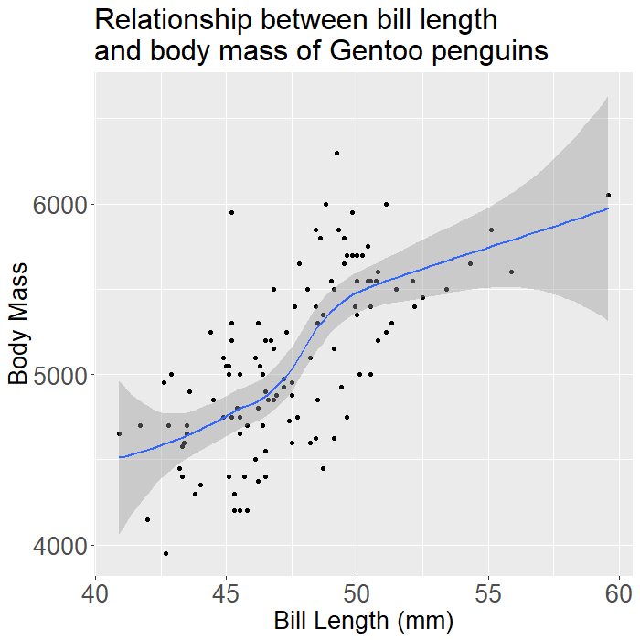
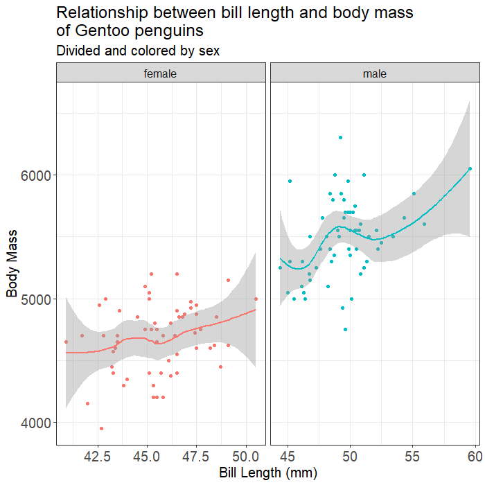
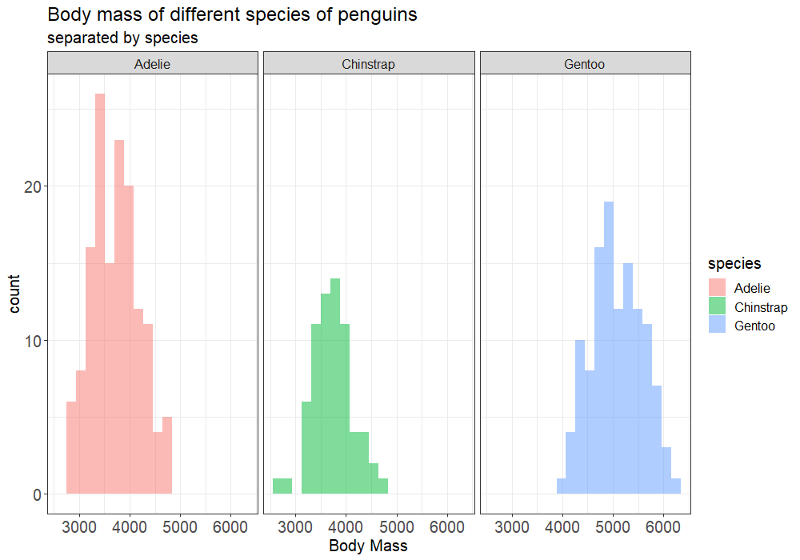

```{r setup, include=FALSE}
knitr::opts_chunk$set(echo = TRUE, warning = FALSE, message = FALSE)
```

# We’ll use the penguins dataset to put your new R and ggplot skills to the test!

# Load necessary libraries

Remember, if it’s the first time using any package, you’ll need to install the package first **install.packages(“name_of_package”)** before calling the library function
```{r}
library(tidyverse)
library(palmerpenguins)
library(ggeasy) # this may be new to you, try googling it if you are unfamiliar with this package! 
```

# First we’ll take a look at the penguins dataset

Let’s create a new variable called my_penguins to save this dataset to
```{r}
head(penguins)
my_penguins <- penguins # once you run this line of code, you will see my_penguins appear in your global environment
```

# Getting to know the data
We went through this in Tuesday’s QnA session, so I’m including the code below, but see if you can answer the questions on your own!

1. How many species of penguins are included in this dataset? What are their names?
2. What is the range of the years?
3. How many islands are there? What are they?

```{r}
levels(my_penguins$species) # levels() only works for factor variables   
unique(my_penguins$species)
my_penguins$year <- as.numeric(as.character(my_penguins$year))
range(my_penguins$year)
levels(my_penguins$island)
```

# Challenge Time!

Below you’ll see a series of plots generated from this dataset. Your task is simple…reproduce the plots! Okay, maybe it’s not such a simple task, but give it a go.

 <br>

 <br>

 <br>